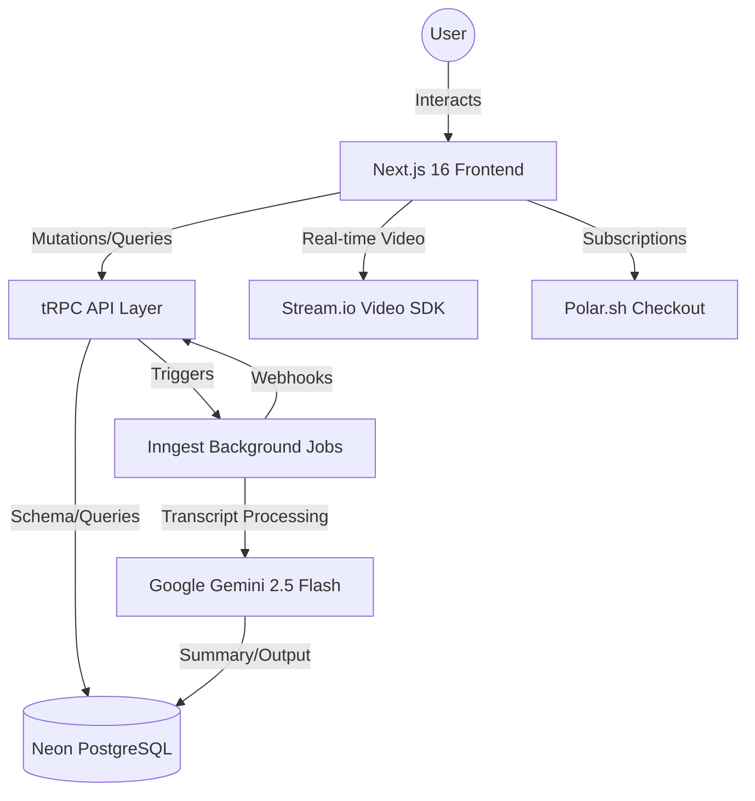

# Meet.AI — The Future of Intelligent Meetings 🚀

[](https://nextjs.org/)
[](https://www.typescriptlang.org/)
[](https://tailwindcss.com/)
[](https://opensource.org/licenses/MIT)

Meet.AI is an AI-native meeting platform that doesn't just record your calls—it understands them. Built with the latest Next.js 16 stack, it provides real-time video, automated AI summaries, and intelligent agents that live within your meeting context.

---

## 🌐 Live Demo

<p align="center">
  <a href="https://meetai-assistant.vercel.app" target="_blank">
    
  </a>
</p>

<p align="center">
  Real-time meetings. AI summaries. Context-aware agents.
</p>

## ✨ Key Features

- 🎥 **Pro Video Experience**: High-quality, low-latency video meetings powered by **Stream.io**.
- 🤖 **AI-Native Agents**: Create custom agents to join your meetings, provide insights, and answer questions.
- 📝 **Automated Summaries**: Get concise, formatted markdown summaries of every meeting using **Google Gemini 2.5 Flash**.
- 💬 **Context-Aware Chat**: Real-time chat with AI agents that remember your meeting history.
- 💳 **Premium Tiers**: Fully integrated subscription management via **Polar.sh**.
- 🔐 **Secure & Fast**: Enterprise-grade authentication using **Better Auth** with Google and GitHub providers.

---

## 🏗️ System Architecture

Our architecture is designed for speed, scalability, and AI-first processing:



---

## 🛠️ Technical Stack

| Category              | Technology                                                      |
| :-------------------- | :-------------------------------------------------------------- |
| **Frontend**          | Next.js 16 (App Router), Tailwind CSS 4, Radix UI, Lucide Icons |
| **Backend**           | tRPC, Node.js, TypeScript                                       |
| **Database**          | Neon (Serverless PostgreSQL), Drizzle ORM                       |
| **Authentication**    | Better Auth (OAuth & Email/Password)                            |
| **AI / NLP**          | Google Gemini 2.5 Flash, Inngest Agent Kit                      |
| **Background Jobs**   | Inngest (Event-driven workflows)                                |
| **Video / Real-time** | Stream.io Video & Chat SDK                                      |
| **Payments**          | Polar.sh (Next-gen billing)                                     |

---

## ⚡ Quick Start

### Prerequisites

- Node.js 20+
- A Neon PostgreSQL instance
- API Keys for Google Gemini, Stream.io, and Polar.sh

### Installation

1. **Clone the repository**

   ```bash
   git clone https://github.com/tinhne/meetai.git
   cd meetai
   ```

2. **Install dependencies**

   ```bash
   npm install --legacy-peer-deps
   ```

3. **Environment Variables**
   Create a `.env` file in the root directory and add the following:

   ```env
   # Database
   DATABASE_URL=your_neon_db_url

   # Auth
   BETTER_AUTH_SECRET=your_auth_secret
   BETTER_AUTH_URL=http://localhost:3000
   GOOGLE_CLIENT_ID=...
   GOOGLE_CLIENT_SECRET=...
   GITHUB_CLIENT_ID=...
   GITHUB_CLIENT_SECRET=...

   # AI & Cloud
   GOOGLE_AI_API_KEY=your_gemini_key
   INNGEST_EVENT_KEY=...
   NEXT_PUBLIC_STREAM_API_KEY=...
   STREAM_API_SECRET=...

   # Premium
   POLAR_ACCESS_TOKEN=...
   NEXT_PUBLIC_POLAR_ORGANIZATION_ID=...
   ```

4. **Run Development Server**
   ```bash
   npm run dev
   ```

---

## 📂 Project Structure

- `src/app`: Next.js Next.js App Router (Routes & Layouts)
- `src/modules`: Domain-driven feature sets (agents, meetings, premium, etc.)
- `src/db`: Database schema and ORM configuration
- `src/trpc`: Typesafe API definitions
- `src/inngest`: Background job workflows and AI agents
- `src/components`: Shared UI components

---

## 📄 License

This project is licensed under the MIT License - see the [LICENSE](LICENSE) file for details.

---

<p align="center">Built with ❤️ by <b>Tinh Dev</b></p>
